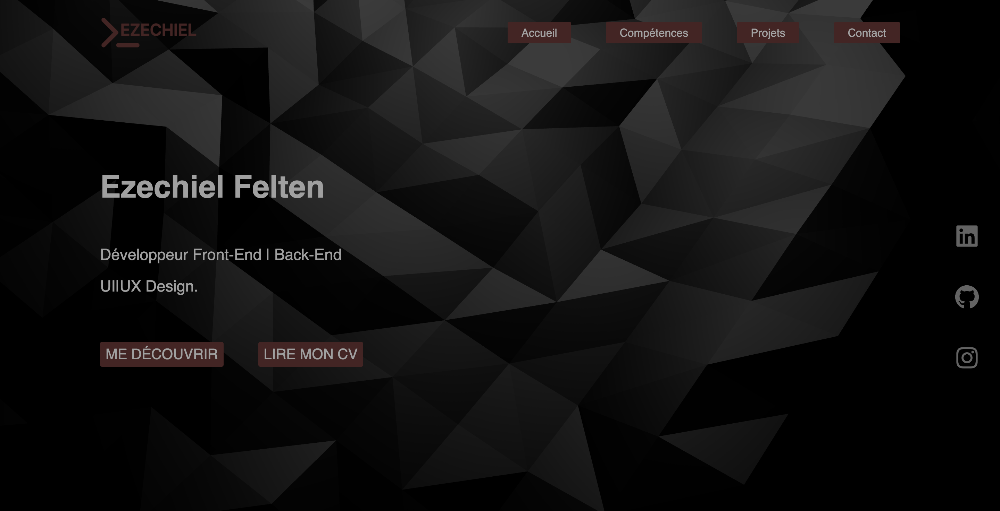

<div align='center'>
    <a href='https://ezechiel-felten.vercel.app/'></a>
</div>

# Portfolio 

Explorez mon portfolio pour découvrir une exposition détaillée de mon parcours, de mes compétences ainsi que des descriptions complètes de chacun de mes projets. Vous y trouverez également mes coordonnées pour rester en contact.

# Technologie utilisée

- Next js (framework)
- React js (framework)
- vanta js (librarie d'animation de fond)
- gsap (librarie d'animation)
- CSS (stylisé mes pages)
- redux (stockage local)

### lien du site https://ezechiel-felten.vercel.app/

# Installation du projet en local 

Exécutez ces lignes de commande dans votre terminal sur votre ordinateur
`````bash
git clone https://github.com/ezeflt/portfolio.git
cd portfolio
yarn install
yarn dev
`````

# Développeur 

Ezechiel Felten </br>

feltenezechiel1@gmail.com</br>
[linkedin](https://www.linkedin.com/in/ezechiel-felten-475693248/)</br>
[portfolio](https://ezechiel-app.vercel.app/)</br>

